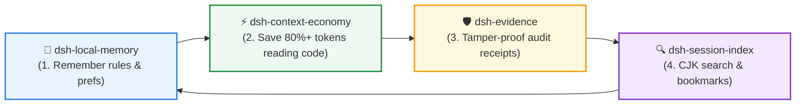

<div align="center">

# 🛡️ dsh-evidence

**Verifiable, tamper-proof audit evidence bundles for DSH agent execution**  
*SHA256 Manifests • Append-Only Hash-Chain Receipts • Temporal Validity (`validUntil`) • Zero Fluff*

[](https://github.com/huangjua)
[](#)
[](LICENSE)

[Features](#-key-features) • [Quick Start](#-quick-start) • [DSH Power Suite](#-dsh-power-suite) • [Tools](#-available-tools) • [简体中文](README_zh.md)

</div>

---

### 💡 Why dsh-evidence?

AI agents often hallucinate "tests passed" or succeed on commands that silently produce bad outputs. When delivering code or auditing tasks, there is no way to prove *what really ran* and *whether outputs were modified afterwards*.

**`dsh-evidence` provides cryptographic proof of agent task execution:**
- ⛓️ **Append-Only Hash-Chained Receipts**: Every snapshot or execution link appends a cryptographic hash to `receipt.jsonl`. Any post-hoc file modification immediately fails verification.
- 📦 **Self-Contained Snapshots (`copy=true`)**: Bundle output directories, generated binaries, and validation scripts into portable, verifiable tarballs.
- ⏱️ **Temporal Validity (`validUntil`)**: Explicitly tracks when evidence becomes `stale` (touched) or `expired`, preventing outdated logs from justifying new claims.
- 🤝 **Honest Boundary Declarations**: Clear definitions of what cryptographic hashing can and cannot prove.

---

## 🚀 Quick Start

### Installation

```bash
# In your DSH plugin environment
dev_inject_plugin @dsh-external/dsh-evidence
```

### Typical Usage Flow

1. **Create evidence bundle**: `evidence_create name="bench-2026" description="Performance audit"`
2. **Add snapshots & assertions**: `evidence_add name="bench-2026" paths="bench.json|verify.py" claim="30% speedup verified" validUntil=2026-12-31`
3. **Audit and verify**: `evidence_verify name="bench-2026"`

---

## 🧩 DSH Power Suite

This plugin is part of the **DSH Agent Power Suite** — 4 modular, zero-hard-dependency plugins forming a complete closed-loop developer workflow:



| Plugin | Role in Suite | Synergy with Evidence |
|---|---|---|
| 🛡️ **[dsh-evidence](https://github.com/huangjua/dsh-evidence)** | **Audit & Receipts** (Current) | Creates cryptographic audit bundles and hash-chained receipts for agent execution. |
| 🧠 **[dsh-local-memory](https://github.com/huangjua/dsh-local-memory)** | **Memory Layer** | Commits critical decisions into memory only after validating evidence receipts. |
| ⚡ **[dsh-context-economy](https://github.com/huangjua/dsh-context-economy)** | **Context Economy** | Benchmarks (e.g. `savings-bench`) register evidence snapshots to prove real token savings. |
| 🔍 **[dsh-session-index](https://github.com/huangjua/dsh-session-index)** | **Session Search** | Search past session archives to pinpoint historical evidence receipts and jump back. |

---

## 📖 Deep Dive & Reference

<details>
<summary><b>🛠️ Available Tools (5 Tools)</b></summary>

| Tool | Purpose |
|---|---|
| `evidence_create` | Initialize evidence directory, `evidence.json` (v2), and `receipt.jsonl` chain. |
| `evidence_add` | Add files/directories (SHA256, size, mtime) with optional `claim`, `validUntil`, and `copy=true`. |
| `evidence_verify` | Recalculate SHA256 hashes, verify chain consistency, and audit against expiration/stale status. |
| `evidence_list` | List all local evidence packages with summary health counts. |
| `evidence_show` | Inspect complete manifest, claim assertions, timestamps, and receipt chains. |

</details>

<details>
<summary><b>📁 Bundle Structure & Manifest Format</b></summary>

```text
~/.dsh/evidence/<name>/
  evidence.json     # Manifest with top-level manifestHash self-integrity
  receipt.jsonl     # Append-only hash-chained receipts
  files/            # Self-contained copies when copy=true
```

</details>

<details>
<summary><b>⚖️ Honest Capability Declarations</b></summary>

- **Can Prove**: Snapshot content matching, file alteration (corrupt/stale), manual edits to `evidence.json`, and receipt sequence tampering.
- **Cannot Prove**: Command intention authenticity, author identity, or file system root access tampering (hashes are not digital signatures).

</details>

<details>
<summary><b>🧪 Building & Testing</b></summary>

```bash
node scripts/build.mjs                 # Compile src ➡️ lib
npm run typecheck
npm test                                # Run test suite
npm run pack:check                      # Packaging check
```

</details>

---

<div align="center">
<sub>Part of the <a href="https://github.com/huangjua">DSH Agent Power Suite</a>. Licensed under BSD-3-Clause.</sub>
</div>
