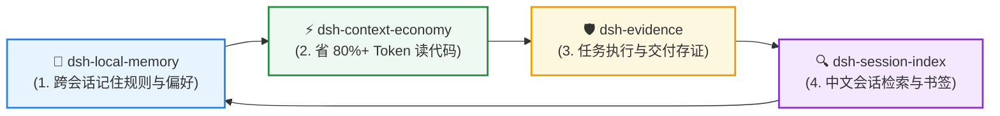

<div align="center">

# 🛡️ dsh-evidence

**为 DSH 的执行过程与交付结果开具可复核、防篡改的“审计存证包”**  
*SHA256 清单 • 追加式哈希链收据 • 时效性判定 (`validUntil`) • 拒绝口说无凭*

[](https://github.com/huangjua)
[](#)
[](LICENSE)

[核心亮点](#-为什么需要审计存证包) • [快速上手](#-快速上手) • [DSH 效率套件](#-dsh-agent-效率套件) • [工具列表](#-深度参考与架构) • [English](README.md)

</div>

---

### 💡 为什么需要审计存证包？

AI Agent 经常产生“测试全部通过”的幻觉，或者执行了可能产生错误产物的命令。在交付代码或任务核验时，缺乏一种手段证明**当时到底跑了什么、生成了什么、事后是否被篡改**。

**`dsh-evidence` 为 Agent 执行提供密码学级别的存证收据：**
- ⛓️ **追加式哈希链收据**：每次快照向 `receipt.jsonl` 追加一条哈希链，任何事后改动均会在校验时立刻报警。
- 📦 **自包含快照归档 (`copy=true`)**：将输出目录、生成文件与验证脚本一键打包进证据包，支持离线迁移。
- ⏱️ **时效性判定 (`validUntil`)**：显式区分正常、Stale（被触碰）与 Expired（已过期），杜绝拿旧证据冒充新结论。
- 🤝 **严谨诚实声明**：明确界定“能证明什么（快照未篡改）与不能证明什么（不代替身份签名）”。

---

## 🚀 快速上手

### 安装

```bash
# 在 DSH 插件环境中注入
dev_inject_plugin @dsh-external/dsh-evidence
```

### 典型使用

1. **创建证据包**：`evidence_create name="bench-2026" description="性能审计"`
2. **添加快照与断言**：`evidence_add name="bench-2026" paths="bench.json|verify.py" claim="性能提升 30% 且通过所有测试" validUntil=2026-12-31`
3. **一键复核**：`evidence_verify name="bench-2026"`

---

## 🧩 DSH Agent 效率套件

本插件是 **DSH Agent 开发者效率套件** 的核心成员 —— 4 个插件无硬依赖，组合使用实现完整工程闭环：



| 插件 | 套件定位 | 与审计存证层的协作 |
|---|---|---|
| 🛡️ **[dsh-evidence](https://github.com/huangjua/dsh-evidence)** | **审计存证层** (当前) | 负责关键操作的 SHA256 哈希链存证与时效性审计。 |
| 🧠 **[dsh-local-memory](https://github.com/huangjua/dsh-local-memory)** | **本地记忆层** | 关键决策写入记忆前先由 Evidence 固化收据，确保存证事实可靠。 |
| ⚡ **[dsh-context-economy](https://github.com/huangjua/dsh-context-economy)** | **上下文经济层** | 节流基准测试（如 `savings-bench`）自动产出证据包登记到本插件。 |
| 🔍 **[dsh-session-index](https://github.com/huangjua/dsh-session-index)** | **会话历史检索** | 通过会话检索快速定位生成证据包的历史对话现场。 |

---

## 📖 深度参考与架构

<details>
<summary><b>🛠️ 5 个 evidence_* 工具列表</b></summary>

| 工具 | 作用 |
|---|---|
| `evidence_create` | 创建证据包目录、`evidence.json` 清单与 `receipt.jsonl` 哈希链收据 |
| `evidence_add` | 添加文件/目录快照（SHA256/size/mtime），可选 `claim`、`validUntil` 与 `copy` |
| `evidence_verify` | 重算哈希，检测 missing / corrupt / stale / expired，校验清单完整性 |
| `evidence_list` | 列出所有证据包（含过期与健康统计） |
| `evidence_show` | 查看完整清单与收据链记录 |

</details>

<details>
<summary><b>📁 证据包文件结构</b></summary>

```text
~/.dsh/evidence/<name>/
  evidence.json     # 清单（含 manifestHash 自完整性）
  receipt.jsonl     # 追加式哈希链收据（防篡改轨迹）
  files/            # copy=true 时的独立副本
```

</details>

<details>
<summary><b>⚖️ 诚实能力声明</b></summary>

- **能证明**：快照时文件内容、事后是否被改动（corrupt/stale）、清单是否被篡改、操作记录是否被伪造。
- **不能证明**：命令真实意图合法性、文件真实作者身份（哈希并非数字签名）。

</details>

<details>
<summary><b>🧪 构建与测试</b></summary>

```bash
node scripts/build.mjs                 # 编译 src → lib
npm run typecheck
npm test                                # 运行测试套件
npm run pack:check                      # 打包检查
```

</details>

---

<div align="center">
<sub>属于 <a href="https://github.com/huangjua">DSH Agent 开发者效率套件</a> • 采用 BSD-3-Clause 开源协议</sub>
</div>
